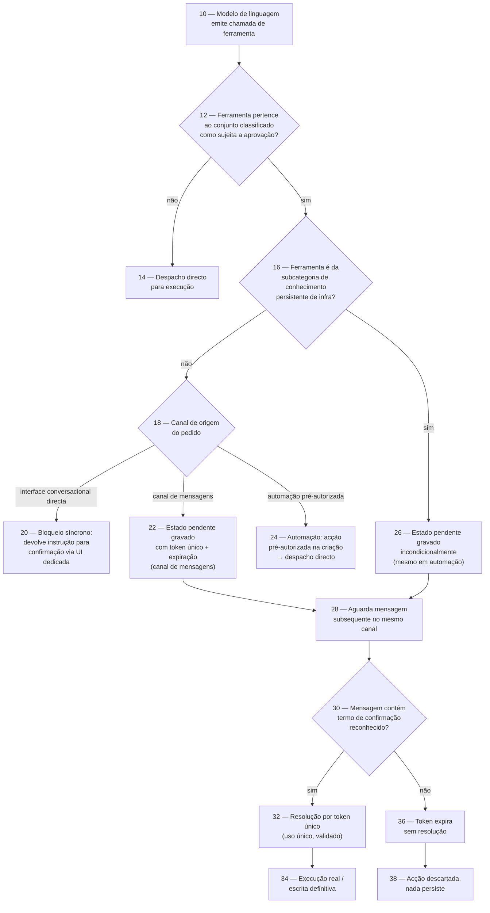
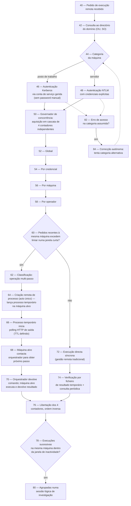
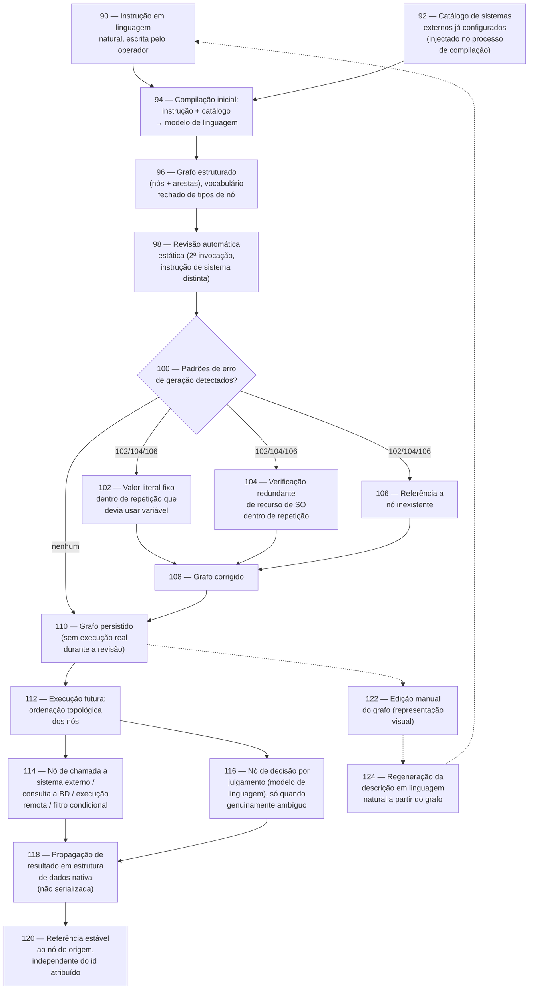

# Diagramas de Fluxo — Base para Pedido de Patente

Diagramas de suporte à Memória Descritiva Técnica (`Jarvis-Memoria-Descritiva-Patente.md`). Cada figura usa numeração de referência própria, independente das outras — convenção normal em desenhos de patente, onde cada figura é lida isoladamente. Estes diagramas são um rascunho técnico funcional; a formatação final (traço a preto e branco, legendas numeradas conforme o padrão exigido pelo IAPI) fica a cargo de quem prepara a submissão.

---

## Figura 1 — Mecanismo A: Aprovação aplicada no despacho

**Legenda de referência:**
`10` chamada de ferramenta pelo modelo · `12` verificação de classificação estática · `14` caminho sem aprovação · `16` verificação de subcategoria incondicional · `18` determinação de canal · `20/22/24` os três comportamentos por canal · `26` desvio incondicional para pendência · `28-30` espera e reconhecimento de confirmação · `32` validação por token de uso único · `34` efeito persistente real · `36-38` expiração sem resolução.

---

## Figura 2 — Mecanismo B: Execução remota governada com autenticação dual e bootstrap por polling de saída

**Legenda de referência:**
`40-44` recepção e classificação da máquina · `46/48` bifurcação de autenticação · `50-58` governador de concorrência em 4 camadas · `60-62` detecção automática de operação multi-passo · `64-70` transporte por bootstrap com polling de saída · `72-74` transporte directo com verificação por ficheiro · `76` libertação dos contadores · `78-80` agrupamento em sessão por janela de inactividade · `82-84` correcção autónoma de categoria.

---

## Figura 3 — Mecanismo C: Compilação de instrução em linguagem natural para grafo de execução determinístico

**Legenda de referência:**
`90-94` instrução original e compilação assistida por catálogo · `96` grafo resultante, vocabulário fechado · `98-108` segunda passagem de revisão estática e correcção · `110` persistência só após revisão · `112-116` execução determinística pós-compilação, com nó de julgamento isolado · `118` propagação estruturada entre nós · `120` referência estável ao nó de origem · `122-124` ciclo de reversibilidade texto↔grafo.

---

## Nota

As referências numéricas (10, 12, 14…) seguem a convenção comum de desenhos de patente — números pares, com espaço para inserção de elementos adicionais em revisões futuras sem renumerar tudo. Ajustar conforme a convenção específica exigida pelo AOPI.
